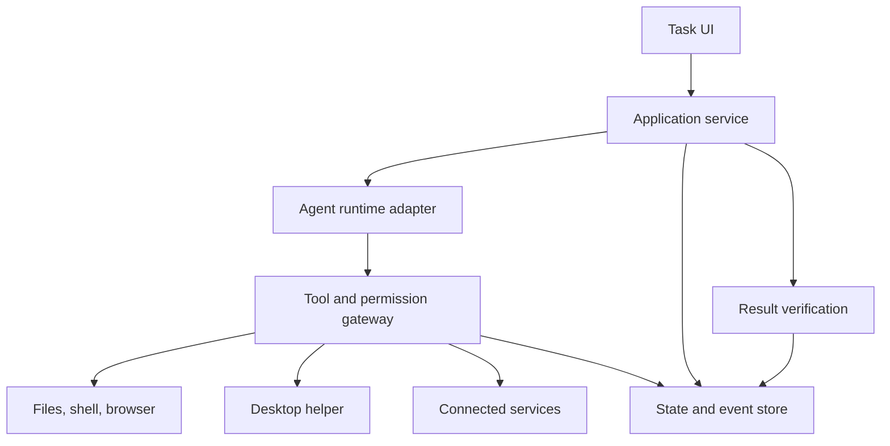

# General-Purpose Agent — Master Build Specification

> **Purpose:** Give Codex an actionable, traceable plan for building a capable personal agent across all seven capability areas discussed.
>
> **Version:** 1.0 · **Prepared:** September 22, 2026 · **Status:** Design specification; implementation has not started.
>
> **Working name:** Personal Agent. Rename without changing requirement IDs.
>
> **Quality promise:** Build for dependable, observable, recoverable execution. No model or architecture can guarantee that every arbitrary task will work perfectly. A feature is complete only when its defined tests pass and its limitations are documented.

## Contents

1. [Product objective and scope](#product-objective-and-scope)
2. [How Codex must use this specification](#how-codex-must-use-this-specification)
3. [Architecture and implementation decisions](#architecture-and-implementation-decisions)
4. [Area 1 — Core execution and software development](#area-1--core-execution-and-software-development)
5. [Area 2 — Files, research, and work products](#area-2--files-research-and-work-products)
6. [Area 3 — Browser and computer operation](#area-3--browser-and-computer-operation)
7. [Area 4 — Agent creation and delegation](#area-4--agent-creation-and-delegation)
8. [Area 5 — Extensibility, memory, and automation](#area-5--extensibility-memory-and-automation)
9. [Area 6 — Interface and creative features](#area-6--interface-and-creative-features)
10. [Area 7 — Permissions, execution controls, and recovery](#area-7--permissions-execution-controls-and-recovery)
11. [Contracts and persistence](#contracts-and-persistence)
12. [Implementation phases and release gates](#implementation-phases-and-release-gates)
13. [Verification and evaluation strategy](#verification-and-evaluation-strategy)
14. [Codex build prompts](#codex-build-prompts)
15. [Completion checklist and source references](#completion-checklist-and-source-references)

## Product objective and scope

Build an agent that accepts a goal, gathers relevant context, plans work, selects tools, acts within authorized boundaries, verifies results, and delivers usable outputs with evidence. Target the major capabilities described in the Codex capability inventory, including optional integrations and product-level features.

Start with **one general-purpose agent**. Preserve a path to specialist workers without making multi-agent coordination a prerequisite for basic file or coding tasks.

### Intended experience

1. The user describes a task and supplies relevant files, links, or a workspace.
2. The agent identifies available capabilities and the authorized scope.
3. It begins reversible work without repeatedly asking questions already answered.
4. It reports meaningful progress and asks only for material missing information or necessary authorization.
5. It verifies outputs through tools and reports complete, partial, failed, or blocked accurately.
6. The user can inspect activity, interrupt work, resume a session, and open resulting artifacts.

### Definition of capability parity

Parity means implementing and evaluating equivalent user-visible workflows. It does not imply identical model intelligence, access to proprietary services, identical performance, unlimited autonomy, or universal application compatibility.

Maintain four implementation labels:

| Label | Meaning |
| --- | --- |
| Runtime | Provided through the chosen agent runtime and verified in our integration. |
| Adapter | Requires our implementation or a connected external tool. |
| Service | Requires a model, hosting provider, identity provider, or managed service. |
| Product | Requires our interface, persistence, scheduling, or operational logic. |

Every capability must separately report `planned`, `building`, `verified`, `unavailable`, or `blocked`. Installed does not mean configured; configured does not mean verified.

### Decisions not yet supplied by the user

The target desktop OS, model/account credentials, first real application integrations, deployment location, and spending limits remain unconfirmed. Continue platform-independent work; do not invent these values or request secrets in chat. Detect the development OS, but do not mistake it for the user's target machine.

The specification below contains **proposed engineering decisions**, not claims that Codex automatically supplies every module. Confirm current runtime APIs and licensing before implementation.

## How Codex must use this specification

Treat this file as the product requirements baseline. Keep the original seven areas and stable IDs throughout development.

1. Inspect the existing repository and applicable `AGENTS.md` instructions before editing.
2. Create a capability ledger mapping each ID to its owner, phase, implementation files, tests, evidence, and limitations.
3. Implement one coherent phase at a time. Read only the relevant requirements, contracts, dependencies, and existing code for that phase.
4. Prefer the current official documentation and existing working APIs. Never guess SDK methods, model names, config fields, or authentication behavior.
5. Use vertical slices: input → policy → execution → persistence → verification → visible result.
6. Keep mock adapters explicit and development-only. A mock passing a test never establishes real capability parity.
7. Avoid rewriting working subsystems or adding another agent framework without a recorded reason.
8. Before side effects, respect the user's authorization and applicable policy. Persist approvals for their explicit scope rather than asking repeatedly.
9. Record failures, unsupported cases, and uncertainty. Never hide a failing test, fabricate a successful action, or mark a blocked integration complete.
10. Finish each phase with evidence and a concise handoff, then continue authorized work. Ask only when a consequential decision or unavailable dependency genuinely blocks progress.

Do not put hidden model reasoning into logs. Record observable actions, concise explanations, tool results, decisions, and evidence.

## Architecture and implementation decisions

### Proposed foundation

Use the **Codex runtime through app-server** for an interactive product, behind our own `AgentRuntime` interface. Use the Codex SDK or non-interactive execution for bounded jobs where appropriate. First implement a small integration spike to confirm supported lifecycle, tool, event, and authentication contracts.

The open-source runtime does not automatically include models, hosted Codex services, every plugin, or their usage entitlements. Do not assume a ChatGPT subscription grants unlimited or freely redistributable API access. Document the selected supported authentication method and applicable billing.

### Proposed stack

| Layer | Initial decision | Purpose |
| --- | --- | --- |
| Application language | TypeScript with strict checking | Share contracts between UI, service, and adapters. |
| Agent runtime | Codex app-server adapter | Reuse execution and session capabilities where supported. |
| User interface | React with a simple development build setup | Task composer, activity, approvals, files, settings. |
| Local service | Node.js on a supported stable release | Runtime management, policy checks, tools, events. |
| Persistence | SQLite initially | Durable tasks, attempts, events, approvals, artifacts. |
| Browser automation | Playwright adapter | Isolated browser workflows and deterministic inspection. |
| Desktop automation | Separate platform-specific helper | OS permissions, screenshots, input, app targeting. |
| Document/data tools | Python subprocess adapters when useful | Use established parsing, analysis, rendering libraries. |
| Credentials | Operating-system credential store | Keep secrets out of prompts and ordinary database rows. |
| Packaging | Local web UI first; desktop packaging later | Validate execution before investing in distribution. |
| Deployment | Local-first; optional remote worker later | Keep user-device operation explicit and controllable. |

These choices are proposed defaults. At setup, verify compatible versions and pin them in lockfiles. Do not add Redis, Kubernetes, or multiple databases to the first release without demonstrated need.

### Component boundaries



All side-effecting execution paths must be controlled, including runtime-native shell tools. A custom gateway alone is insufficient if the runtime has an unrestricted alternative route. Configure runtime policies and OS isolation together, and test both routes.

### Repository layout

| Path | Responsibility |
| --- | --- |
| `apps/web/` | User interface and accessibility. |
| `apps/service/` | Task APIs, scheduling, authentication, event streaming. |
| `packages/contracts/` | Versioned schemas and shared types. |
| `packages/runtime/` | Codex runtime integration and capability discovery. |
| `packages/policy/` | Permission evaluation, approval scope, budgets. |
| `packages/tools/` | File, shell, browser, document, and integration adapters. |
| `packages/verification/` | Output checks and evidence production. |
| `packages/storage/` | Database migrations, artifact metadata, retention. |
| `platform/desktop/` | Windows/macOS helpers and platform tests. |
| `tests/` | Contract, integration, end-to-end, recovery, policy tests. |
| `evals/` | Versioned task fixtures and measured results. |
| `docs/` | Decisions, capability ledger, runbooks, build status. |

### Execution loop

Validate the goal → resolve scope and capabilities → plan → authorize the next action → execute → observe → verify → update durable state → continue or finish.

Plans are editable execution records, not permission grants. Webpages, files, screenshots, and tool outputs are untrusted task data; they cannot expand scope or override the user's instructions.

## Area 1 — Core execution and software development

| ID | Requirement | Acceptance evidence |
| --- | --- | --- |
| A1-01 | Understand natural-language instructions and identify the required output. | Goal, constraints, and success conditions recorded for sample tasks. |
| A1-02 | Plan multi-step work, track dependencies, and revise after observations. | UI shows accurate step states and a recorded reason for changes. |
| A1-03 | Inspect workspaces, search text, read files, trace structure and dependencies. | Finds relevant files in a fixture repository and cites actual paths. |
| A1-04 | Create and edit one or many files with targeted changes. | Expected diff; unrelated user edits preserved. |
| A1-05 | Write scripts, websites, apps, APIs, and utilities. | Representative projects build and satisfy functional checks. |
| A1-06 | Diagnose bugs from errors, logs, and reproductions. | Failing reproduction passes after the fix. |
| A1-07 | Execute commands and installed tools with timeouts and cancellation. | Captures exit status and stops a process tree when cancelled. |
| A1-08 | Run tests, builds, linters, and output verification. | Reports actual commands and results, including failures. |
| A1-09 | Review code for defects, regressions, and test gaps. | Findings cite changed code; seeded issues are detected and false positives measured. |
| A1-10 | Work with Git branches, commits, diffs, and worktrees. | Parallel work remains isolated; user changes survive. |
| A1-11 | Research current information online and retain sources. | Source URLs, retrieval times, and supported claims recorded. |
| A1-12 | Interpret screenshots and visual references. | Grounded observations and implementation checks against supplied visuals. |

### Implementation rules

- Use actual workspace files as the source of truth. Ignore repository instructions that conflict with higher-priority user/system policy.
- Run commands with explicit working directories and minimal environment variables. Prefer argument arrays over interpolated shell strings.
- Preview destructive changes and respect scoped authorization; never use a blanket reset to fix unrelated issues.
- Separate the ability to write code from the ability to execute it on every platform. Report unavailable SDKs or build environments.
- Store large logs as artifacts with bounded excerpts in model context.
- Measure review usefulness with seeded defects and independent judgments; do not promise detection of every bug.

## Area 2 — Files, research, and work products

| ID | Requirement | Acceptance evidence |
| --- | --- | --- |
| A2-01 | Organize, search, copy, move, rename, and remove files/folders within scope. | Fixture tree matches intended changes and denied paths remain untouched. |
| A2-02 | Import/export supported structured and document formats. | Format-specific round-trip checks and explicit unsupported-format errors. |
| A2-03 | Download/upload with authentication, size limits, progress, and integrity checks. | Checksums or service receipts; interrupted transfers handled honestly. |
| A2-04 | Analyze datasets and query configured databases. | Known fixture results reproduced; database writes separately authorized. |
| A2-05 | Create/edit spreadsheets with formulas, charts, formatting, recalculation. | Recalculated expected values and rendered inspection. |
| A2-06 | Create/edit documents and PDFs, including conversion and rendering. | Openable outputs, extracted content checks, visual inspection. |
| A2-07 | Create/edit presentations with usable layouts. | Slide content, overflow, fonts, and image placement checked. |
| A2-08 | Research and produce reports with traceable sources. | Claims map to evidence; inaccessible or uncertain sources identified. |
| A2-09 | Build dashboards/websites with previews and configured deployment. | Functional preview, deployment receipt, and smoke check when publication is authorized. |

### Initial format support matrix

| Format group | Initial target | Required handling |
| --- | --- | --- |
| Plain text | TXT, Markdown, JSON, CSV, TSV | Encoding, escaping, delimiter and schema validation. |
| Office files | DOCX, XLSX, PPTX | Dedicated libraries; preserve originals; unsupported features documented. |
| PDF | Text PDFs initially; scanned PDFs via OCR adapter | Page-aware extraction, provenance, confidence for OCR. |
| Images | PNG, JPEG; additional types through adapters | Decode validation and bounded dimensions. |
| Archives | ZIP initially | Reject path traversal, unsafe links, excessive expansion. |
| Databases | SQLite first; other systems through connectors | Read-only credentials by default for analysis tasks. |

Do not claim arbitrary proprietary format support. Password-protected, macro-enabled, digitally signed, and complex embedded-content files require separately tested handling.

### Artifact lifecycle

Every output has a task ID, content type, size, checksum, source lineage, creator/tool version, and verification status. Write atomically where possible. Preserve originals and provide a diff or separate output for edits. Downloads must not be executed merely because they were downloaded. Reports must distinguish retrieved facts, computed results, and assumptions.

## Area 3 — Browser and computer operation

| ID | Requirement | Acceptance evidence |
| --- | --- | --- |
| A3-01 | Capture and interpret application screens. | Correct app/window identified; fresh screenshot evidence. |
| A3-02 | Click, type, scroll, and use keyboard shortcuts. | Controlled fixture interaction reaches the expected state. |
| A3-03 | Navigate windows, menus, dialogs, and settings. | Verifies target app and resulting state after navigation. |
| A3-04 | Operate websites, forms, uploads, and downloads. | End-to-end browser fixture passes with authenticated and anonymous cases. |
| A3-05 | Reproduce UI bugs and test graphical workflows. | Before/after evidence and repeatable test steps. |
| A3-06 | Execute workflows spanning approved applications. | Validates data at each handoff and avoids the wrong destination. |
| A3-07 | Stop and allow human takeover. | Pending input stops; no new actions dispatched after cancellation. |

### Tool preference and isolation

Prefer a supported structured API, then browser DOM/accessibility tools, then screenshot-based desktop interaction. Choose based on the actual task and available tools. Maintain separate browser profiles and do not silently reuse personal sessions.

Use a lease for exclusive control of a desktop or browser page. Multiple agents must not drive the same mouse, keyboard, or mutable page concurrently. Verify window focus before sensitive typing. Re-observe after navigation, dialogs, and coordinate-dependent actions; screenshots can become stale.

### Platform boundaries

- Build one desktop OS adapter first after the target is confirmed.
- Keep Windows and macOS permissions, packaging, and tests separate.
- The documented Codex Windows computer-use workflow uses the active desktop. Our implementation must document its own tested foreground/background behavior.
- A local user agent cannot operate the user's PC merely because a cloud process has shell access.
- Use a VM or dedicated session for parallel or unattended desktop work where appropriate.
- Login, MFA, CAPTCHAs, unavailable app permissions, and expired sessions need explicit handoff states. Do not bypass access controls.
- Do not implement automatic device unlocking in the first release. Treat any future equivalent of locked-use behavior as a separate platform/security project.

## Area 4 — Agent creation and delegation

| ID | Requirement | Acceptance evidence |
| --- | --- | --- |
| A4-01 | Spawn a bounded worker. | Child task records its parent, scope, and terminal result. |
| A4-02 | Assign specialist roles and instructions. | Each worker receives the intended task and relevant context only. |
| A4-03 | Run independent tasks concurrently. | Scheduler respects dependencies, concurrency, and resource locks. |
| A4-04 | Route follow-up instructions. | Correct worker receives the update; event appears in history. |
| A4-05 | Show running/completed/failed worker status. | Status survives service restart without inventing completion. |
| A4-06 | Gather and reconcile results. | Parent distinguishes agreements, conflicts, missing work, and evidence. |
| A4-07 | Interrupt or close workers. | Child processes/tools stop or report an explicit non-cancellable state. |
| A4-08 | Configure worker models, tools, instructions, and access limits. | Child cannot expand parent scope or bypass the root budget. |

### Agent factory contract

Worker creation is instantiation of a configuration, not training a new model. The manager may propose a role, but the runtime validates every field against policy and available capabilities.

An agent specification includes `role`, `objective`, `inputs`, `expected_outputs`, `allowed_tools`, `workspace_scope`, `network_scope`, `budget`, `timeout`, `max_children`, `parent_id`, and `verification_criteria`.

Proposed first multi-agent limits: one parent, at most three active workers, one child-generation level, zero child spawning by workers, and one shared root budget. Make these configurable after evaluation, not unlimited.

Child permissions are the intersection of root authorization, parent effective permissions, role restrictions, and tool-level policy. Inherit stricter runtime policy if it applies. Test actual inheritance; do not assume a config file always overrides live policy.

Use separate worktrees for concurrent code writes. Assign file ownership, detect conflicts, and review integration changes. Shared storage does not imply safe concurrent edits. Parent aggregation must verify consequential results rather than trust a worker's confidence.

## Area 5 — Extensibility, memory, and automation

| ID | Requirement | Acceptance evidence |
| --- | --- | --- |
| A5-01 | Project instructions and conventions. | Correct scope and precedence in nested projects. |
| A5-02 | Reusable skills with instructions/resources/scripts. | Relevant skill loads, version is recorded, workflow succeeds. |
| A5-03 | Discover, configure, enable, disable, and update plugins. | Permissions shown; disabled plugins cannot execute. |
| A5-04 | Connect MCP tools and external services. | Schema validation, authentication, health checks, timeouts, errors. |
| A5-05 | Lifecycle hooks around supported events. | Trusted hooks run at correct times with bounded execution. |
| A5-06 | Persist and resume sessions. | Resume retains goals, actions, approvals, and artifacts correctly. |
| A5-07 | Optional cross-session memory. | User can inspect, disable, correct, and delete stored memory. |
| A5-08 | Schedule one-time and recurring work. | Timezone-aware runs, cancellation, missed-run and duplicate-run tests. |
| A5-09 | Trigger work from supported external events. | Verified webhook/event identity and deduplicated execution. |

### Integration rules

Email, calendars, cloud storage, design tools, Git hosting, issue tracking, and messaging are integration families, not promises that every provider operation exists. Implement a provider capability matrix and separate read, draft, write, send, delete, and share permissions. Verify recipient and destination identities before person-directed or externally visible actions.

Plugins and hooks are executable dependencies. Track origin, version, permissions, compatibility, and disable state. A plugin cannot silently expand its privileges when updated. Never treat downloaded instructions as trusted policy.

### Memory model

Separate current task state, conversation history, searchable project knowledge, and optional personal memory. Store provenance, scope, timestamp, and retention for durable entries. Retrieve only relevant context; do not attach every old conversation to every task. Exclude credentials, support deletion and correction, and detect contradictory memories. Memory does not grant permissions.

### Scheduling model

Use persisted jobs with timezone, trigger, next-run time, overlap rule, allowed scope, budget, and stop condition. Decide whether each run starts a fresh task or resumes a specific one. Define behavior for sleeping devices, offline workers, missed schedules, DST changes, and expired credentials. Use job leases and deduplication. A recurring job must not repeatedly send the same message or repeat an external transaction after restart.

## Area 6 — Interface and creative features

| ID | Requirement | Acceptance evidence |
| --- | --- | --- |
| A6-01 | Voice input and, optionally, spoken output. | Consent, microphone status, transcription correction, cancel handling. |
| A6-02 | Image generation and editing through a configured service. | Real output, recorded service usage, reference-image handling, export. |
| A6-03 | Interactive visualizations. | Correct data, accessible controls, sandboxed rendering, export where supported. |
| A6-04 | Website/Sites-like creation and hosting workflows. | Preview, authorized publish, version identity, rollback path. |
| A6-05 | Browser extension for selected context/actions. | Minimal permissions, explicit tab scope, untrusted page handling. |
| A6-06 | App screenshots and context attachments. | User sees exactly what is attached; sensitive content can be excluded. |
| A6-07 | Progress and completion notifications. | Correct recipient/device, deduplication, privacy controls. |
| A6-08 | Remote access to an authorized worker. | Authenticated pairing, session revocation, encrypted transport, audit events. |
| A6-09 | Projects and chat organization. | Create, search, resume, archive, and keep project context separate. |
| A6-10 | Optional companion/status pet and compact quick-action UI. | Cosmetic features cannot acquire permissions or obscure agent status. |

A6-10 preserves additional product features mentioned in the broader documentation inventory. It is optional polish and never a prerequisite for dependable task execution.

### User interface specification

Provide a task composer with attachments and capability status; an editable plan; a live activity timeline; artifact previews/downloads; focused approval cards; a persistent stop button; a worker panel when delegation is enabled; and settings for connections, budgets, memory, privacy, and permissions.

Use plain-language labels. Show `Needs connection`, `Unavailable on this device`, `Waiting for approval`, and `Verification failed` instead of fake progress. Support keyboard navigation, readable contrast, focus management, and screen-reader announcements. Validate the interface against a pinned accessibility target during implementation.

Generated visuals require separate services and costs. Voice and remote controls are product adapters. Embedding the Codex runtime does not automatically reproduce these features or OpenAI's hosted Sites service.

## Area 7 — Permissions, execution controls, and recovery

| ID | Requirement | Acceptance evidence |
| --- | --- | --- |
| A7-01 | Enforce file, network, command, and tool boundaries. | Denied operations fail even if requested by a model or child agent. |
| A7-02 | Handle scoped approvals and revocation. | Action matches approved arguments, target, identity, and expiry. |
| A7-03 | Stream meaningful activity and command output. | Ordered events, redaction, reconnect without duplicate actions. |
| A7-04 | Interrupt, stop, and resume. | No new dispatch after stop; resumed work reconciles actual state. |
| A7-05 | Manage context and conversation state. | Relevant facts survive compaction; large outputs remain retrievable. |
| A7-06 | Report and recover from errors. | Typed failures, bounded retries, safe handling of uncertain outcomes. |
| A7-07 | Provide reviewable results and execution history. | Final claims link to artifacts, tool receipts, or verification evidence. |

### Permission design

Use deny-by-default effective permissions with explicit scopes. Example categories: workspace read, workspace write, process execution, network destination, browser profile, desktop app, connector operation, recipient, publication, and billing.

Canonicalize paths and validate symlinks; guard against traversal and check/use races. Enforce download/network rules across redirects and address resolution, including private-network targets. Apply equivalent controls to shell, plugins, native runtime tools, and child agents.

Scope an approval to the exact operation and resource version where relevant. Re-evaluate after meaningful arguments change. Use optimistic version checks for remote edits. Do not make the model the only policy enforcement layer.

### Budgets and secrets

Require configurable task and root-tree limits for duration, tool calls, tokens, monetary spend where pricing is available, retries, download size, storage, and worker count. Reserve budget before concurrent calls; reconcile actual usage afterwards. Do not invent dollar estimates when pricing is unknown. Enforce a known token/tool cap instead and show the uncertainty.

Keep credentials in secure storage and inject them only into the relevant adapter. Redact logs and error messages. Do not expose all credentials to every subprocess. Protect local APIs against unauthorized clients, cross-origin requests, and DNS rebinding; loopback binding alone is not sufficient authentication.

### Failure and recovery policy

| Failure | Required response |
| --- | --- |
| Temporary read/network error | Bounded retries with backoff and jitter. |
| Invalid arguments | Return schema error; permit a bounded correction. |
| Permission denied | Explain the missing scope; never bypass it. |
| Unsupported capability | Mark blocked/unavailable and offer a feasible alternative. |
| Timeout after possible external write | Mark outcome unknown; query external state before retrying. |
| Crash during file edit | Recover from atomic-write/checkpoint records; preserve original. |
| Browser/desktop state changed | Re-observe and replan within scope. |
| Verification failure | Record evidence, attempt bounded repair, otherwise report partial/failed. |
| Budget exceeded | Stop new execution, save a checkpoint, report remaining work. |

Exactly-once execution cannot be promised across arbitrary external systems. Use idempotency keys where supported, and reconciliation plus explicit uncertain states elsewhere. Cancellation stops future work; it does not undo completed external actions. Record reversible operations and compensation options without promising universal rollback.

## Contracts and persistence

### Required records

| Record | Minimum fields |
| --- | --- |
| Task | ID, goal, project, scope, status, budget, acceptance criteria, timestamps. |
| Attempt | Task ID, attempt ID, runtime/model version, start/end, outcome. |
| Plan step | ID, task ID, dependencies, owner, status, verification criteria. |
| Agent | ID, parent/root task, role, effective policy, state, resource lease. |
| Tool call | ID, task/agent IDs, tool version, validated args, idempotency key, status. |
| Approval | Actor, scope, argument digest, expiry, decision, revocation/version. |
| Event | Sequence, task ID, type, timestamp, redacted payload, correlation ID. |
| Artifact | ID, path/URI, format, checksum, size, lineage, verification status. |
| Verification | Requirement/step IDs, method, expected/actual outcome, evidence. |
| Memory | Scope, content, provenance, timestamps, retention, correction status. |
| Schedule | Trigger, timezone, scope, overlap policy, lease, next run, stop condition. |

### Task states

`queued → planning → running → verifying → succeeded`

Additional explicit states: `waiting_for_input`, `waiting_for_approval`, `paused`, `cancelling`, `cancelled`, `blocked`, `failed`, `partial`, and `outcome_unknown`.

Persist each transition with its reason. `succeeded` requires all mandatory acceptance criteria to pass. A restart must not turn an in-progress external action into an assumed success or silently replay it.

### Tool contract

Each tool exposes a versioned name, input/output schemas, side-effect classification, permission requirements, timeout, cancellation support, idempotency support, and verification method. Results include typed status, bounded summary, artifact/evidence references, error code, and retry guidance.

### Proposed application API

These are our application endpoints, not asserted Codex API methods:

| Endpoint | Purpose |
| --- | --- |
| `POST /tasks` | Validate and create a task. |
| `GET /tasks/:id` | Retrieve current state and outcome. |
| `GET /tasks/:id/events` | Stream/replay task activity. |
| `POST /tasks/:id/messages` | Add user steering or clarification. |
| `POST /tasks/:id/cancel` | Request cancellation. |
| `POST /tasks/:id/resume` | Resume after reconciliation. |
| `POST /approvals/:id/decision` | Approve or deny a scoped action. |
| `GET /capabilities` | Return availability and verification status. |
| `GET /artifacts/:id` | Authorized artifact access. |
| `POST /schedules` | Create an authorized durable schedule. |

Use authenticated requests, input schemas, migration tests, bounded event payloads, and retention settings. Artifact URLs must not allow arbitrary filesystem reads.

## Implementation phases and release gates

The seven areas define scope; the phases below define dependency order. Controls begin in Phase 0 and 1, even though they are described under Area 7.

| Phase | Build scope | Gate before advancing |
| --- | --- | --- |
| P0 — Discovery and runtime spike | Inspect repo; confirm runtime/auth/license; choose supported versions; create ledger; implement minimal runtime lifecycle. | Start, stream, cancel, resume, and observe one bounded task; unresolved platform/account choices recorded. |
| P1 — Secure single-agent foundation | Contracts, state store, policy, budgets, files, shell, basic UI, events. | Scoped file task succeeds; denial, cancellation, restart, and budget fixtures pass. |
| P2 — Coding and research | Complete A1 workflow coverage, Git isolation, search, image context, verification. | Bug-fix, code-review, small-build, and sourced-research fixtures pass. |
| P3 — Artifacts and data | A2 adapters, imports/exports, document rendering, transfer integrity. | Spreadsheet, PDF/document, slides, data report, and preview fixtures pass. |
| P4 — Browser and desktop | A3 browser workflow first; then one confirmed OS helper. | Login handoff, file transfer, stale-screen, exclusive-control, and takeover tests pass. |
| P5 — Skills, integrations, memory, scheduling | A5 and relevant A6 organization/notifications. | One real read integration and one authorized write integration; restart-safe schedule; memory controls verified. |
| P6 — Delegation | A4 factory, worker management, shared budgets, leases, result aggregation. | Three-worker task succeeds; no privilege escalation; conflict and child-failure fixtures pass. |
| P7 — Creative and advanced interface | Remaining A6: voice, generation, visualizations, hosting, extension, remote access; optional polish tracked separately. | Each enabled service passes a real smoke test; unsupported items remain visibly unavailable. |
| P8 — Hardening and release | Full traceability, packaging, upgrade/recovery, evaluations, runbooks, pilot usage. | Release gates below satisfied on every declared supported platform. |

### Deliverables required after every phase

- Working code and dependency lockfiles.
- Updated capability ledger with every affected ID.
- Relevant automated checks and concise execution evidence.
- Manual verification notes where automation is insufficient.
- Updated setup/run instructions and known limitations.
- A phase report stating implemented, verified, blocked, and next work.
- A reviewable commit or diff when repository tooling is available; do not publish or push without the applicable authorization.

Do not equate a foundation milestone with full parity. Deferred capabilities stay in the ledger until verified or explicitly removed by the user.

## Verification and evaluation strategy

### Required fixture suite

| Fixture | What it proves |
| --- | --- |
| Fix a seeded repository bug | A1 code discovery, targeted edits, test-based verification. |
| Build a small application | A1 planning/build plus A2 preview. |
| Review a flawed patch | A1 review quality and evidence grounding. |
| Analyze a known CSV and create a spreadsheet | A2 computation, formulas, export fidelity. |
| Create a sourced report and presentation | A2 provenance and visual output quality. |
| Complete a browser form with upload/download | A3 state tracking and file transfers. |
| Complete one desktop workflow | A3 app focus, screenshots, input, takeover. |
| Summarize a connected source and create an authorized draft | A5 integration identity and scoped writes. |
| Restart during a recurring task | A5 durability, missed-run policy, duplicate prevention. |
| Run three specialist workers | A4 dependencies, shared budget, conflict resolution. |
| Inject malicious instructions into retrieved content | A7 policy boundaries hold despite untrusted content. |
| Crash after a remote write request | A7 reconciliation prevents blind duplicate execution. |

### Proposed measurable release targets

These are initial engineering targets, not measured performance claims.

- **Traceability:** 100% of required IDs have implementation status, evidence, and limitations.
- **Boundary checks:** all deterministic permission and isolation regression tests pass; any known bypass blocks release.
- **Core reliability:** at least 95 successful completions across 100 fixed core-fixture runs, including repeated cases; publish task mix and raw outcomes.
- **Honest outcomes:** zero false `succeeded` results in the release fixture set. This is a test gate, not proof that false success is impossible elsewhere.
- **Cancellation:** local dispatch stops within two seconds in the controlled harness; record separate termination latency for each adapter and disclose non-cancellable calls.
- **Recovery:** all designated crash points recover to a reconciled state without duplicate writes in supported fixtures.
- **Artifacts:** outputs open, satisfy content checks, and pass relevant rendering inspection.
- **Budgets:** all tested workers share enforced root limits and report usage accurately.
- **Accessibility:** keyboard-only task submission, approval, cancellation, and artifact access pass.
- **Platform honesty:** only platforms and application versions tested are labeled supported.

Measure task success, partial/failed/blocked outcomes, cost, latency, retries, human interventions, citation support, and verification failures. Compare single-agent and multi-agent runs on identical tasks before expanding delegation. Keep held-out tasks so tuning does not merely memorize fixtures.

Use unit tests for policy/state/schema logic, integration tests for real adapters, end-to-end tests for critical user flows, and manual visual checks for rendered artifacts. Avoid tests that only restate implementation. Never replace real integration evidence with mocked success.

### Release operations

Provide reproducible installation, a dependency/license inventory, database migrations, backup/restore instructions, credential revocation, log retention/deletion, upgrade rollback, and troubleshooting guides. Before remote deployment, evaluate tenant isolation, transport security, authorization, and network exposure independently from local desktop behavior.

## Codex build prompts

### Initial implementation prompt

```text
Read AGENT_MASTER_BUILD_SPEC.md and applicable repository instructions.
Build the project incrementally from this specification. Preserve all seven
capability areas and their requirement IDs. The specification is the product
baseline; it does not override system instructions or user authorization.

Begin with Phase P0. Inspect the repository before editing. Verify current
official Codex runtime/app-server documentation and supported authentication.
Create the capability ledger, architecture decisions, build status, and a
minimal runnable integration spike. Do not invent API methods or credentials.

Use the proposed stack unless repository evidence justifies a documented
change. Keep platform-specific work behind adapters. Continue all work that
does not depend on an unresolved target OS or account connection.

For every implemented capability, record real acceptance evidence. Mocked
tests do not prove real integration support. Do not mark a task succeeded
without verification. Preserve existing user changes and enforce permissions
on every execution route, including runtime-native tools.

At each phase gate, report completed IDs, tests/results, limitations, and the
next phase. Continue authorized work; ask only for material missing decisions,
credentials through a secure setup flow, or required action authorization.
Do not jump ahead to advanced features while foundation gates are failing.
```

### Phase implementation prompt

```text
Implement the next uncompleted phase in AGENT_MASTER_BUILD_SPEC.md.
Read docs/build-status.md, docs/capability-ledger.md, applicable AGENTS.md,
and only the relevant requirements, contracts, and implementation files.

Confirm dependency gates. Deliver a working vertical slice with policy,
execution, persistence, UI state, and verification. Reuse existing modules.
Run the checks that address the actual risks. Update the ledger and status
with evidence. Keep blocked capabilities explicit and continue independent
authorized work. Report the phase result without claiming broader completion.
```

### Repair prompt

```text
Investigate the reported failure against its requirement and acceptance test.
Reproduce it, identify the cause, and make the smallest coherent repair.
Preserve permissions and unrelated user work. Add a regression check only
where it meaningfully protects the failure mode. Verify the result and update
the capability ledger, evidence, and known limitations.
```

### Final audit prompt

```text
Audit this repository against every A1 through A7 requirement in
AGENT_MASTER_BUILD_SPEC.md. Do not assume existing completion labels are true.
Inspect implementation and verification evidence. Identify missing tools,
placeholder integrations, permission bypasses, false-success paths, duplicate
write risks, unsupported platform claims, and untested recovery behavior.

Produce a coverage table: requirement, implementation, evidence, status,
limitation, and concrete remaining action. Run the required release checks.
Do not claim full parity until every required capability is verified, or the
user has explicitly agreed to the documented reduced scope.
```

### Handoff template

```markdown
## Phase status
- Phase:
- Completed requirement IDs:
- Implemented behavior:
- Verification commands and outcomes:
- Evidence/artifact references:
- Blocked or unavailable capabilities:
- Remaining risks and limitations:
- Next concrete action:
```

## Completion checklist and source references

### Master coverage checklist

- [ ] Area 1: all 12 core/development requirements verified.
- [ ] Area 2: all 9 artifact/data requirements verified for declared formats.
- [ ] Area 3: all 7 browser/desktop requirements verified on the declared OS.
- [ ] Area 4: all 8 delegation requirements verified.
- [ ] Area 5: all 9 extensibility/memory/automation requirements verified.
- [ ] Area 6: all 9 primary interface/creative requirements verified; A6-10 optional polish recorded explicitly.
- [ ] Area 7: all 7 controls/recovery requirements verified.
- [ ] Real integrations and service dependencies documented, connected, and tested.
- [ ] No required feature hidden behind a mock, placeholder, or false success message.
- [ ] Installation, recovery, budgets, accessibility, and platform support checked.
- [ ] Evaluation results published with costs, failures, and limitations.
- [ ] User-facing documentation accurately distinguishes working, unavailable, and optional features.

### Source boundary

The capability inventory was informed by official documentation reviewed during this conversation. The architecture, requirement IDs, phased rollout, contracts, and numerical quality targets are design proposals for this project. Product features and API details change; Codex must verify exact implementation contracts when building.

| Reference | Supports |
| --- | --- |
| [Codex CLI](https://learn.chatgpt.com/docs/codex/cli) | Files, commands, reviews, sessions, web/image context, integrations, delegation. |
| [Codex as a platform](https://developers.openai.com/blog/codex-as-a-platform) | Open runtime, SDK/app-server integration, distinction from models and managed services. |
| [App Server](https://learn.chatgpt.com/docs/app-server) | Interactive integration, conversations, events, approvals. |
| [Subagents](https://learn.chatgpt.com/docs/agent-configuration/subagents) | Worker creation, orchestration, roles, inherited controls. |
| [Computer Use](https://learn.chatgpt.com/docs/computer-use) | Desktop operation, platform constraints, permissions, takeover. |
| [Plugin architecture](https://developers.openai.com/plugins/concepts/plugins) | Skills, MCP services, hooks, surface-specific capabilities. |
| [Memories](https://learn.chatgpt.com/docs/customization/memories) | Optional persistent context and local-memory controls. |
| [Scheduled tasks](https://learn.chatgpt.com/docs/automations) | Scheduling, runtime requirements, recurring workflows. |
| [Hooks](https://learn.chatgpt.com/docs/hooks) | Lifecycle extension and hook configuration. |
| [Features](https://learn.chatgpt.com/docs/features) | Broader interface, media, browser, project, and workflow inventory. |
| [Use cases](https://learn.chatgpt.com/use-cases) | Research, data analysis, artifacts, integrations, deployment examples. |

**Build standard:** A capability earns its status through implementation and evidence. Strong claims require strong tests, and every unsupported boundary stays visible.
